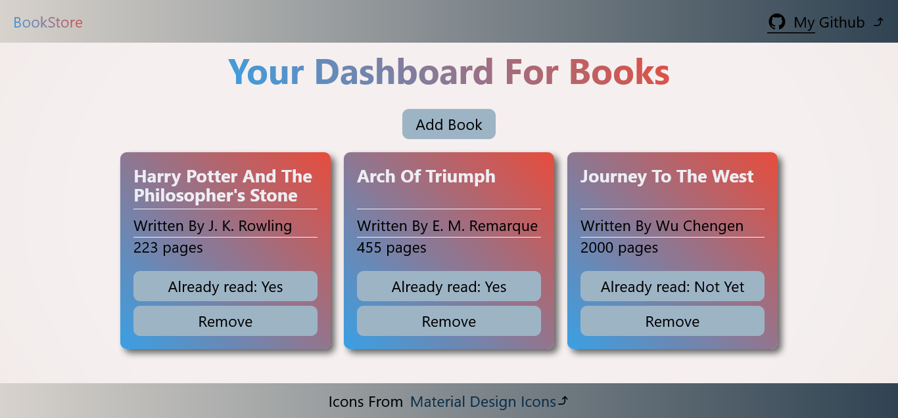
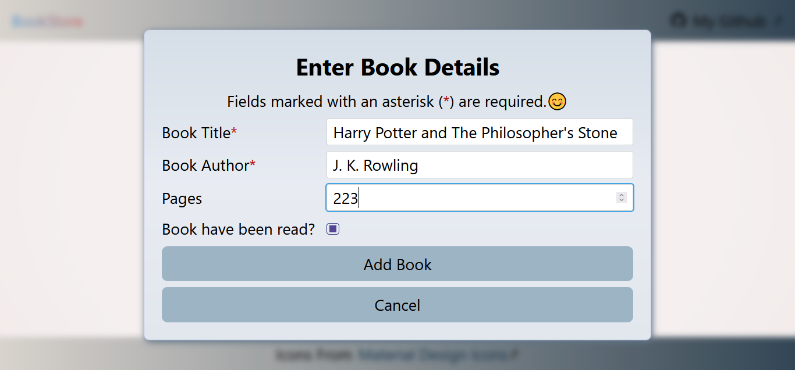
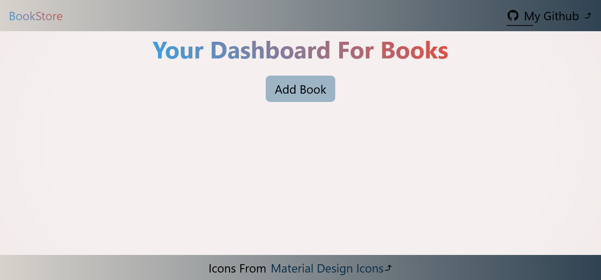

# library-odin

## Library The Odin Project

This project is a small web application that lets users manage a library of books. Key features include:

- Adding books with details like title, author, number of pages, and read status.
- Displaying books dynamically in the form of interactive cards.
- Removing books from the library.
- Toggling the read status of each book.
- Ensuring every book has a unique ID using crypto.randomUUID() for smooth operations like removal and updates.
- Added responsiveness for different screen sizes.

Books are stored in an array, and the app uses DOM manipulation to display them. The project is part of The Odin Project, and the assignment details can be found here [Project: Library | The Odin Project](https://www.theodinproject.com/lessons/node-path-javascript-library).

